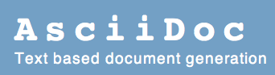

// Variables

:Author:    Rémi Le Gourrierec

:Email:     remi.legourrierec@gmail.com

:Date:      20/10/2017

:Revision:  1.0

Auteur {Author} , {Email}

Version {Revision}, le {Date}

===== A propos d'AsciiDoc:
AsciiDoc est un outil de documentation permettant de détacher la forme du fond à travers un language de markup simple.
Il n'y a plus de perte de temps à corriger la mise en plage, les alignements souvent hasardeux de Word.

On ne passe pas plus de temps à creer des éléments (tableaux, liste, etc) sous Word que sous AsciiDoc car la syntaxe est très simple.

La forme est définie une fois au niveau du générateur et tout les documents générés par ce dernier auront la même forme d'appliquée.

===== Autres choses à savoir sur AsciiDoc:

* Le style du rendu est personalisable.
** On peux générer des pdfs, des pages html en un simple clic.
*** On peux inclure des vidéos (seulement utile pour le html).
**** C'est un vrai outil professionel pour travailler de la documentation.
***** Il est possible de générer un site web directement à partir des documents.

*Last but not the least :* 
En utilisant une approche documentaire comme si c'était du code informatique (chose qu'on ne peut pas faire avec Word) le champ des possibilité est grand ouvert :

* L'éditeur :
** est un plugin eclipse et il supporte l'autocomplétion.
** L'éditeur, supporte l'autocomplétion.
** L'éditeur, supporte tout les raccourcis clavier d'eclipse.
* Gestion de version avec Git (A mort SVN et CVS) :
** Tracabilité des modifications.
** Possibilité de faire des branches.
** Pull request (gestion des responsabilités).

===== Comparatif AsciiDoc+Git vs Word+Mail:

.Table Title
|===
|*Fonction* |*AsciiDoc+Git*|*Word+Mail*

|Format de sortie
|Pdf, Html, Website, epub, docbook
|.doc, Pdf

|Maintenabilité
|Excellente
|Assez limité

|Gestion de versions
|Oui
|Non

|Contrôles des droits
|Total
|Partiel (pas de validation des modifications par un autre utilisateur)

|===

===== En résumé:
AsciiDoc est véritable outil professionnel pour la gestion de la documentation, ce que word n'est pas... et ne sera #jamais!#
// Je trouve que cette remarque est partiale...mais c'est tellement vrai.
